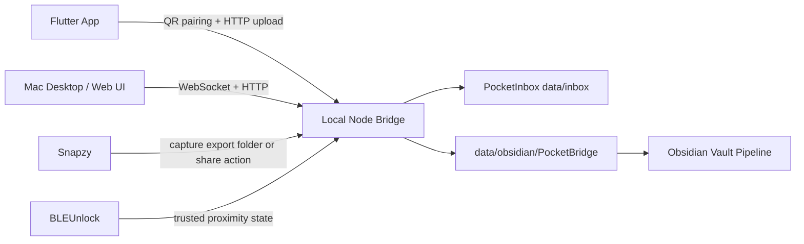

# PocketBridge Architecture

## System Shape

## Local Node Bridge

The server is the first integration anchor. It should run on the Mac and expose LAN-reachable endpoints for the phone after pairing.

- `POST /pairing/session`: create a short-lived pairing token and QR payload. The Mac Web UI can pass its current origin as `bridgeUrl` so physical phones scan a LAN-reachable URL.
- `POST /pairing/confirm`: confirm the token from the mobile app.
- `POST /upload`: accept multipart files and inspiration text.
- `GET /items`: list PocketInbox entries.
- `GET /items/:itemId/download`: stream a file-backed PocketInbox entry from `data/inbox`.
- `POST /share`: register an item that Mac wants to send to the phone.
- `GET /share`: list phone share queue entries with `item` details and optional `downloadPath`.
- `POST /share/:shareId/sent`: let the phone acknowledge a queued share as received.
- `POST /export/:itemId`: export an inbox item into an Obsidian-friendly vault and mark it `exported`.
- `POST /snapzy/import`: import files from `data/watch/snapzy`, `PB_SNAPZY_WATCH_DIR`, or the legacy `integrations/snapzy/inbox` fallback.
- `GET /health`: validate local service status.
- `WS /events`: notify Mac UI and phone app when items arrive or state changes.

## PocketInbox

PocketInbox is intentionally local-first. MVP data lives under `data/inbox` and `data/metadata.json`.

Each item should track:

- `id`
- `kind`: `image`, `document`, `text`, or `link`
- `source`: `phone`, `mac`, `snapzy`, or `system`
- `title`
- `createdAt`
- `originalName`
- `mimeType`
- `size`
- `filePath`
- `status`: `inbox`, `exported`, or `archived`
- `knowledgeTarget`

## Adapter Boundaries

Snapzy adapter:

- MVP can watch an export directory or accept a manually dropped file.
- Current bridge imports all files from `data/watch/snapzy` through `POST /snapzy/import`.
- `PB_SNAPZY_WATCH_DIR` can point to a real Snapzy export directory for the demo machine. The older `SNAPZY_EXPORT_DIR` override is still supported.
- Later versions can integrate with Snapzy automation or share extensions.

BLEUnlock adapter:

- MVP should expose a simulated trusted state if direct BLEUnlock state is not available.
- Demo script can show phone proximity changing the trust indicator.

Knowledge-base adapter:

- MVP exports Markdown files into `inbox/`, copies file-backed assets into `assets/pocketbridge/`, writes an Obsidian-style asset reference, and stores the Markdown path in `knowledgeTarget`.
- Later versions can call richer knowledge-base APIs or MCP tools.

## MVP Risk Rule

Do not let one integration block the full demo. If Snapzy or BLEUnlock cannot be automated in time, preserve the interface and use a manual or simulated adapter with visible status.

## File Download Boundary

The bridge only downloads files whose resolved path is inside `data/inbox`. Text-only items return `404` for the download endpoint. This keeps Mac-to-phone transfer useful for demo files without exposing arbitrary local files.
